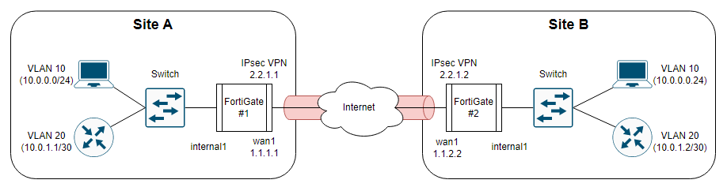

# 포티게이트 장비에서 VxLAN over IPsec 구현(다중 VLAN)

## 구성도


## 1. WAN 인터페이스 설정

<table style="width:500">
<tr>
  <td>FG#1</td>
  <td>FG#2</td>
</tr>
<tr>
  <td>

```
config system interface
  edit "wan1"
    set vdom "root"
    set ip 1.1.1.1 255.255.255.0
    set allowaccess ping fgfm
    set type physical
    set role wan
  next
end
```

  </td>
  <td>

```
config system interface
  edit "wan1"
    set vdom "root"
    set ip 1.1.1.2 255.255.255.0
    set allowaccess ping fgfm
    set type physical
    set role wan
  next
end
```

  </td>
</tr>
</table>


## 2. IPsec VPN 터널 설정

<table style="width:500">
<tr>
  <td>FG#1</td>
  <td>FG#2</td>
</tr>
<tr>
  <td>

```
config vpn ipsec phase1-interface
  edit "fg1-vpn"
    set interface "wan1"
    set peertype any
    set net-device disable
    set proposal aes256-sha1
    set remote-gw 1.1.1.2
    set psksecret PreSharedKey
  next
end

config vpn ipsec phase2-interface
  edit "fg1-vpn"
    set phase1name "fg1-vpn"
    set proposal aes256-sha1
    set auto-negotiate enable
  next
end

config system interface
  edit "fg1-vpn"
    set vdom "root"
    set ip 2.2.2.2 255.255.255.255
    set allowaccess ping
    set type tunnel
    set remote-ip 2.2.2.1 255.255.255.252
    set interface "wan1"
  next
end
```

  </td>
  <td>

```
config vpn ipsec phase1-interface
  edit "fg2-vpn"
    set interface "wan1"
    set peertype any
    set net-device disable
    set proposal aes256-sha1
    set remote-gw 1.1.1.1
    set psksecret PreSharedKey
  next
end

config vpn ipsec phase2-interface
  edit "fg2-vpn"
    set phase1name "fg2-vpn"
    set proposal aes256-sha1
    set auto-negotiate enable
  next
end

config system interface
  edit "fg2-vpn"
    set vdom "root"
    set ip 2.2.2.1 255.255.255.255
    set allowaccess ping
    set type tunnel
    set remote-ip 2.2.2.2 255.255.255.252
    set interface "wan1"
  next
end
```

  </td>
</tr>
</table>


## 3. VLAN 인터페이스 설정

<table style="width:500">
<tr>
  <td>FG#1</td>
  <td>FG#2</td>
</tr>
<tr>
  <td>

```
config system interface
  edit "vlan10"
    set vdom "root"
    set device-identification enable
    set role lan
    set interface "internal1"
    set vlanid 10
  next
  edit "vlan20"
    set vdom "root"
    set device-identification enable
    set role lan
    set interface "internal1"
    set vlanid 20
  next
end  
```

  </td>
  <td>

```
config system interface
  edit "vlan10"
    set vdom "root"
    set device-identification enable
    set role lan
    set interface "internal1"
    set vlanid 10
  next
  edit "vlan20"
    set vdom "root"
    set device-identification enable
    set role lan
    set interface "internal1"
    set vlanid 20
  next
end  
```

  </td>
</tr>
</table>


## 4. VxLAN 인터페이스 설정

<table style="width:500">
<tr>
  <td>FG#1</td>
  <td>FG#2</td>
</tr>
<tr>
  <td>

```
config system vxlan
  edit "vxlan.10"
    set interface "ipsec"
    set vni 10
    set remote-ip "2.2.2.1"
  next
  edit "vxlan.20"
    set interface "ipsec"
    set vni 20
    set remote-ip "2.2.2.1"
  next
end
```

  </td>
  <td>

```
config system vxlan
  edit "vxlan.10"
    set interface "ipsec"
    set vni 10
    set remote-ip "2.2.2.2"
  next
  edit "vxlan.20"
    set interface "ipsec"
    set vni 20
    set remote-ip "2.2.2.2"
  next
end
```

  </td>
</tr>
</table>


## 5. Switch 인터페이스 설정

<table style="width:500">
<tr>
  <td>FG#1</td>
  <td>FG#2</td>
</tr>
<tr>
  <td>

```
config system switch-interface
  edit "vxlan10"
    set vdom "root"
    set member "vxlan10" "vxlan.10"
    set type switch
    set intra-switch-policy implicit
    set mac-ttl 300
    set span disable
  next
  edit "vxlan20"
    set vdom "root"
    set member "vxlan20" "vxlan.20"
    set type switch
    set intra-switch-policy implicit
    set mac-ttl 300
    set span disable
  next
end
```

  </td>
  <td>

```
config system switch-interface
  edit "vxlan10"
    set vdom "root"
    set member "vxlan10" "vxlan.10"
    set type switch
    set intra-switch-policy implicit
    set mac-ttl 300
    set span disable
  next
  edit "vxlan20"
    set vdom "root"
    set member "vxlan20" "vxlan.20"
    set type switch
    set intra-switch-policy implicit
    set mac-ttl 300
    set span disable
  next
end
```

  </td>
</tr>
</table>


# 참조 링크
- https://community.fortinet.com/t5/FortiGate/Technical-Tip-VXLAN-over-IPsec-for-multiple-VLANs-using-software/ta-p/195488